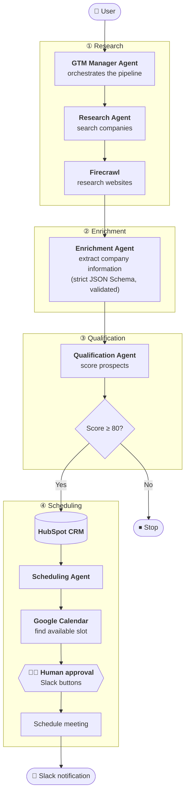

<div align="center">

# 🎯 Multi-Agent GTM Automation Platform

### From "find me prospects" to a booked meeting, with a human approving every one.

**Research → Enrich → Qualify → Schedule.** Four AI agents. One n8n workflow. Zero manual prospecting.


| **85%** | **80 → 22** | **4** | **100%** |
|:---:|:---:|:---:|:---:|
| less manual prospecting effort | leads processed → qualified (27.5%) | specialised agents in the pipeline | of meetings human-approved before booking |

</div>

---

## Architecture



---

## 1. What it does

You describe your ideal customer in plain language. The workflow then:

1. **GTM Manager Agent** turns that description into targeted web-search queries.
2. **Research Agent** runs them through **Firecrawl**, scrapes the company websites, removes duplicates, and filters out directories and social sites.
3. **Enrichment Agent** extracts a structured company profile from each page (name, industry, location, size, business model, products, tech, buying signals). Output is forced into a strict JSON Schema and **validated in code**. Anything malformed is dropped, never passed on.
4. **Qualification Agent** scores each company 0 to 100 against your ICP with reasons and concerns. Only leads at or above the threshold (default **80**) continue.
5. Qualified companies are created in **HubSpot**.
6. **Scheduling Agent** reads your **Google Calendar** availability, assigns each lead a distinct free slot inside working hours, and drafts a meeting title and agenda.
7. **A human approves in Slack.** Each lead arrives as a card with score, reasons, concerns, proposed slot and agenda, with **Approve and book** and **Reject** buttons.
8. Only after **Approve** is the event created in Google Calendar, and Slack confirms.

## 2. Why human-in-the-loop

A meeting invite lands on a real person's calendar on your company's behalf. Everything up to that point is automated, which captures most of the time savings. The last step needs a person, which protects against wrong-fit leads, bad timing and embarrassing mistakes.

The approval links are built to be safe to click, and hard to abuse:

| Protection | How |
|---|---|
| **Tamper-proof** | The proposed meeting is embedded in the link and signed with **HMAC-SHA256**. Any edit to slot, company or agenda invalidates it (HTTP 403). |
| **No double-booking** | The Google event ID is derived from the signature, so clicking Approve twice cannot create two meetings. |
| **Expiry** | A link whose slot has already passed is refused (HTTP 410). |
| **No auto-invites** | Scraped email addresses are never invited automatically. |

## 3. Key features

- 🧠 **Multi-agent orchestration.** A manager coordinates four specialised agents across a 4-stage pipeline.
- 🌐 **Automated web research.** Firecrawl and search APIs over REST, with tool calling for agent-driven research.
- 🧾 **Schema-validated enrichment.** OpenAI Structured Outputs plus an independent JSON Schema validation step. Bad records are dropped with a reason.
- 📊 **Structured scoring.** Integer score, fit reasons and concerns, clamped to 0 to 100.
- 🚦 **Score gate.** Only leads at or above the threshold reach the CRM.
- 🗓️ **Conflict-free scheduling.** One free/busy lookup, then non-overlapping slots with buffers, working hours and weekends respected in your timezone.
- 🔗 **CRM sync.** Companies created in HubSpot with the fit analysis in the description.
- 🧑‍💼 **Human approval** via Slack buttons, signed and single-use.
- 🧯 **Fails loudly, degrades gracefully.** Clear errors when a whole stage fails. If only the agenda-writing call fails, a sensible default agenda is used, so a booking is never blocked.

## 4. Results

Run on **80 leads**:

| Metric | Result |
|---|---|
| Leads processed | **80** |
| Qualified (score ≥ 80) | **22 (27.5%)** |
| Manual prospecting effort | **↓ 85%** |
| Meetings booked without human approval | **0** |

Each of the 22 qualified leads required human sign-off before a meeting was booked.

## 5. Tech stack

| Layer | Technology |
|---|---|
| Workflow orchestration | **n8n** |
| LLM | **OpenAI** (Structured Outputs, default model `gpt-4o-mini`, configurable) |
| Web research | **Firecrawl** search and scrape (REST) |
| Validation | JSON Schema (strict) plus in-workflow validator |
| CRM | **HubSpot** (CRM API v3) |
| Calendar | **Google Calendar** (free/busy and events) |
| Notifications and approvals | **Slack** incoming webhook |

## 6. Quick start

**Prerequisites:** Docker (or an existing recent n8n), an OpenAI key, a Firecrawl key, a HubSpot private app token, Google Calendar OAuth access, and a Slack incoming-webhook URL.

### 6.1 Run n8n

```bash
docker compose up -d        # n8n on http://localhost:5678
```

### 6.2 Import the workflow

n8n UI → **Workflows → Import from file** → `workflows/gtm-automation.json`.

### 6.3 Create credentials in n8n

| Credential | What to enter |
|---|---|
| **OpenAI API** | Your API key |
| **Header Auth** (Firecrawl) | Name `Authorization`, value `Bearer fc-YOUR_KEY` |
| **HubSpot App Token** | Private app token with the `crm.objects.companies.write` scope |
| **Google Calendar OAuth2 API** | Connect the calendar that should receive meetings |

Then open each red-flagged node and pick the matching credential. Slack needs no n8n credential, only a webhook URL (next step).

### 6.4 Configure

Edit the **Config** node (top of the workflow). The two things you must change are the **Slack webhook URL** and the **approval secret**.

| Field | Default | Meaning |
|---|---|---|
| `icp` | sample ICP | Describe who you want, in plain language |
| `maxCompanies` | `10` | Max pages/companies processed per run |
| `queriesCount` | `3` | Search queries the Manager writes |
| `scoreThreshold` | `80` | Minimum score to reach CRM and scheduling |
| `openaiModel` | `gpt-4o-mini` | Any model supporting Structured Outputs |
| `calendarId` | `primary` | Calendar to check and book |
| `timezone` | `Europe/Berlin` | Working hours and labels use this |
| `workStartHour` / `workEndHour` | `10` / `17` | Bookable window, Monday to Friday |
| `meetingMinutes` | `30` | Meeting length |
| `minLeadHours` | `24` | Earliest slot from now |
| `searchDays` | `7` | How far ahead to look |
| `slackWebhookUrl` | placeholder | Slack incoming webhook |
| `approvalWebhookBase` | `http://localhost:5678/webhook/gtm-approval` | Public URL of the approval webhook |
| `approvalSecret` | placeholder | Long random string used to sign links |

Then set the **same** `approvalSecret`, `slackWebhookUrl`, `calendarId` and `timezone` in the **Approval Config** node (bottom flow). Both flows must agree, or links will be refused.

> If n8n is not on the same machine you click Slack buttons from, set `approvalWebhookBase` to n8n's public URL.

### 6.5 Activate and run

1. Toggle the workflow **Active** (approval links use the production webhook).
2. Click **Execute workflow** on the manual trigger.
3. Approval cards appear in Slack. Click **Approve and book**.

## 7. Test it without any API keys

The repo includes a mock of every external service and an end-to-end test that runs the **real workflow in a real n8n**:

```bash
npm install -g n8n
bash tests/run_tests.sh
```

It checks, among other things:

- only leads at or above the threshold reach HubSpot, and low scorers and non-company pages are filtered out
- proposed slots are in the future, avoid busy time, and never overlap each other
- **no calendar event exists before a human approves**
- approve books exactly one event, replaying the link cannot double-book, reject books nothing
- forged signatures, tampered payloads, unknown decisions and expired links are refused

## 8. Project structure

```text
.
├── workflows/
│   └── gtm-automation.json      # the n8n workflow (import this)
├── tests/
│   ├── run_tests.sh             # one-command offline end-to-end test
│   ├── mock_server.py           # fake OpenAI / Firecrawl / HubSpot / Google / Slack
│   ├── make_test_workflow.py    # points a copy of the workflow at the mock
│   ├── check_pipeline.py        # assertions on what the pipeline sent
│   └── approval_flow_test.py    # simulates clicking the Slack buttons
├── docker-compose.yml           # local n8n
└── README.md
```

## 9. Notes and limitations

- HubSpot companies are created without a duplicate check, so re-running with the same ICP can create the same company twice. Add a search step before the create if that matters to you.
- Firecrawl is called on its `/v1/search` endpoint. If your account uses the newer API version, change the path in the **Research - Firecrawl search** node. The parser already accepts both response shapes.
- Scraped email addresses are stored in the analysis only and are never invited to the meeting.
- Costs scale with `maxCompanies`: roughly 2 OpenAI calls per company, plus 1 per qualified lead, plus 1 for the plan.

<div align="center">

⭐ If you found this useful, please star the repo.

</div>
